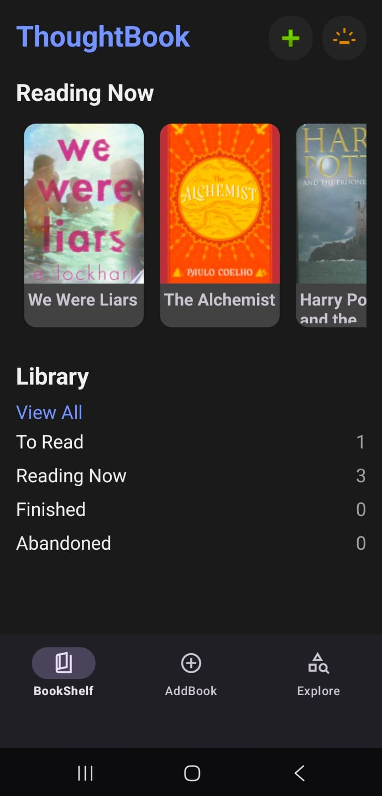
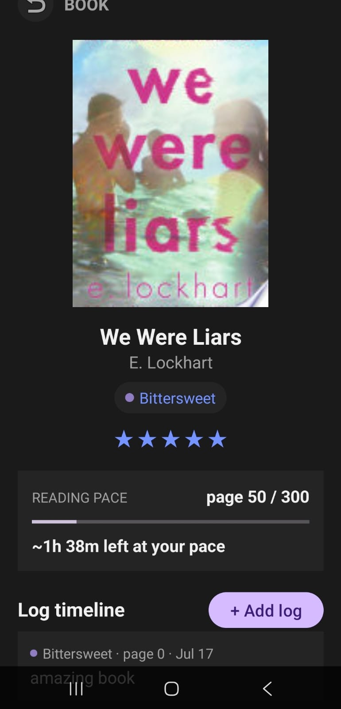
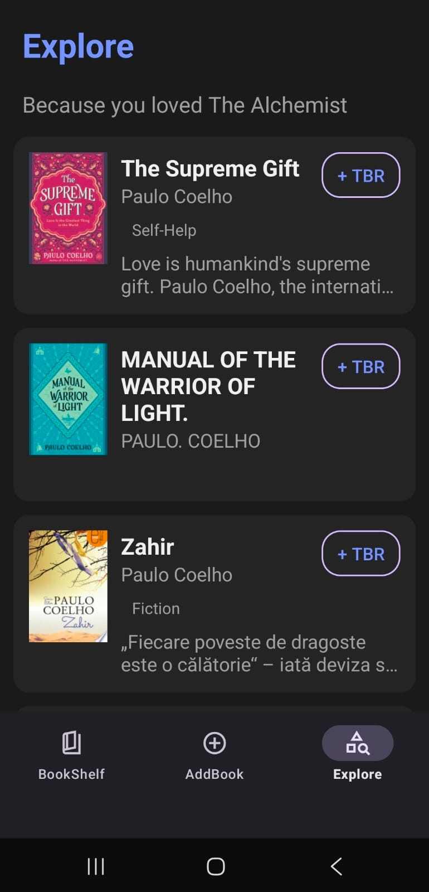
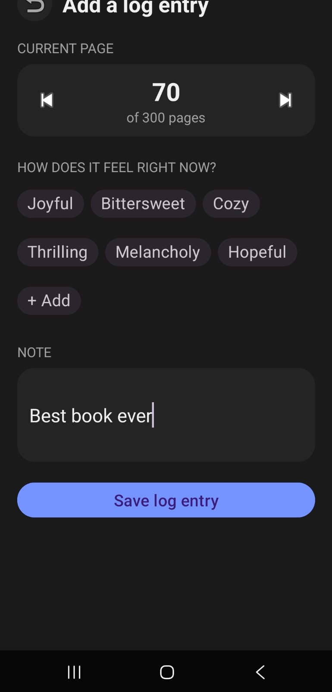

<div align="center">

# ThoughtBook

### An emotion based reading tracker for Android

*Log what you read. Remember how it made you feel.*

<br/>


</div>

<br/>

## Table of Contents

- [About](#-about)
- [Screenshots](#️-screenshots)
- [Features](#-features)
- [Tech Stack & Architecture](#-tech-stack--architecture)
- [Getting Started](#-getting-started)
- [Project Structure](#-project-structure)
- [Data Model](#-data-model-overview)
- [Known Limitations](#-known-limitations)
- [Roadmap](#️-roadmap)
- [Contributing](#-contributing)
- [Author](#-author)

---

## About

Most reading trackers stop at a star rating. **ThoughtBook** treats a book as something you experience over time — so instead of one static review, every book gets a running **emotional log timeline**: page-by-page entries tagged with mood, note, and progress, building a real record of how a story affected you as you read it.

Built as a fun personal Android project with a focus on clean data architecture (Firestore + Repository pattern), resilient API handling (automatic retry on transient failures tho that needs more work), and a calm, distraction-free interface.

**No login required.** Firebase Anonymous Auth gives every user a stable identity from first launch — private data, zero sign-up friction.

---

## Screenshots

<div align="center">

## Screenshots

<div align="center">

|                Bookshelf                |                Book Detail                 |               Explore               |
|:---------------------------------------:|:------------------------------------------:|:-----------------------------------:|
|  |  |  |

|            Add Log Entry            |               Book Grid               |           Detail Book Popup           |
|:-----------------------------------:|:-------------------------------------:|:-------------------------------------:|
|  |  |  |

</div>

---

## Features

| | |
|---|---|
| **Anonymous by default** | Stable identity from first launch, no account required |
| **Custom shelves** | User-named, and a book can belong to more than one |
| **Emotional log timeline** | Full journal per book — mood, page, and note at every entry |
|️ **Real pace tracking** | Time-to-finish estimated from *your* actual reading speed |
| **Smart recommendations** | Genre + author matching via Google Books API, with automatic fallback |
|️ **Full CRUD** | Every log entry can be created, edited, or deleted |
| **Light & dark mode** | User-toggleable, preference persists across sessions |

---

## Tech Stack & Architecture

<div align="center">

| Layer | Choice |
|---|---|
| **Language** | Java |
| **Auth** | Firebase Anonymous Authentication |
| **Database** | Cloud Firestore (document-based, offline-cached) |
| **External API** | Google Books API via Retrofit + Gson |
| **Image Loading** | Glide |
| **UI Pattern** | Repository pattern + LiveData / ViewModel |
| **Navigation** | Android Navigation Component + BottomNavigationView |

</div>

**Design principles this project follows:**
- Single source of truth for data access (`BookRepository`) — no screen talks to Firestore or the network directly
- Reactive UI via `LiveData` — screens observe, they don't poll
- Graceful degradation — API failures retry silently before surfacing to the user; empty states are designed, not accidental


---

## Getting Started

### Prerequisites
- Android Studio (recent stable release)
- A Firebase project with **Anonymous Auth** and **Firestore** enabled
- A Google Books API key ([Google Cloud Console](https://console.cloud.google.com))

### Installation

```bash
git clone https://github.com/WaasilaAsif/ThoughtBook.git
```

1. **Firebase config** — download your own `google-services.json` from your Firebase project console and place it in `app/google-services.json` (not tracked in this repo).
2. **API key** — create a `local.properties` file in the project root:
   ```properties
   GOOGLE_BOOKS_API_KEY=your_key_here
   ```
3. **Sync & run** — open in Android Studio, let Gradle sync, and run on an emulator or device (min SDK 24).

---

## Project Structure

```
app/src/main/java/com/example/thoughtbook/
├── MainActivity.java              # Bottom nav + auth entry point
├── AuthManager.java                # Anonymous auth wrapper
├── BookRepository.java             # Single data-access layer
├── Book.java / Shelf.java / ...    # Firestore data models
├── GoogleBooksResponse.java / ...  # API response models
├── BookshelfFragment.java          # Home screen
├── AddBookFragment.java            # Search & log flow
├── BookDetailActivity.java         # Book detail + timeline
├── ExploreFragment.java            # Recommendations
└── ...
```

---

## Data Model Overview

```
users/{uid}/
  ├── books/{bookId}
  │     └── logs/{logId}      ← subcollection: one doc per journal entry
  └── shelves/{shelfId}
```

Every user is scoped under their own anonymous `uid` — no separate identity system needed, Firestore and Firebase Auth are tied together natively.

---

## Known Limitations

- Firestore security rules are currently in **test mode** — not yet hardened for public release
- Google Books API occasionally returns transient `503`s; automatic retry resolves most of these silently
- Custom emotion tags created mid-session aren't yet persisted for reuse across sessions

---

## Roadmap

- [ ] Favorites / "Starred" books
- [ ] Persisted custom emotion tags
- [ ] Full-library search & sort controls
- [ ] Additional cozy/analog visual theme
- [ ] Production-hardened Firestore security rules

---


## Author

**Waasila Asif**
Computer Science student, NUST SEECS

<div align="center">

*Built one honest bug at a time. All thanks to Claud and Android's documentation T^T* 

</div>